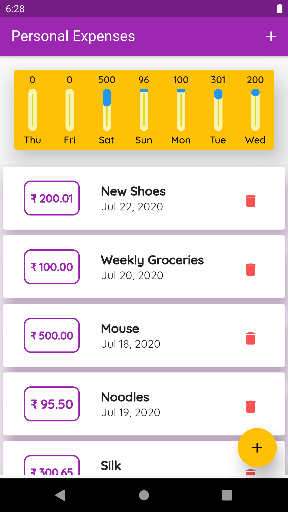
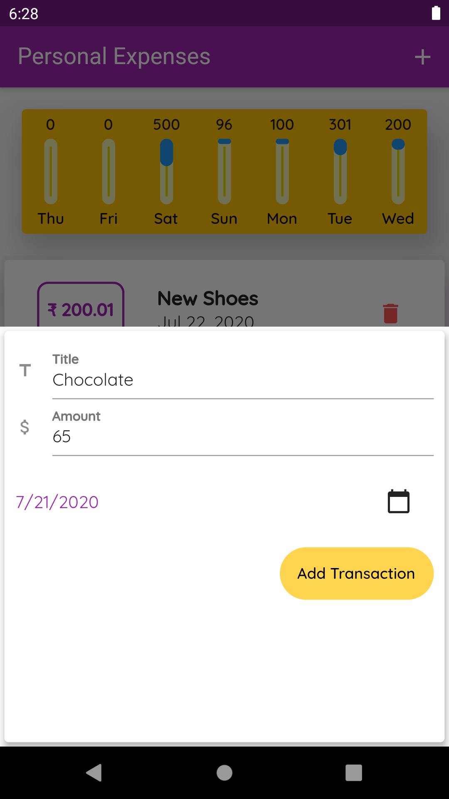
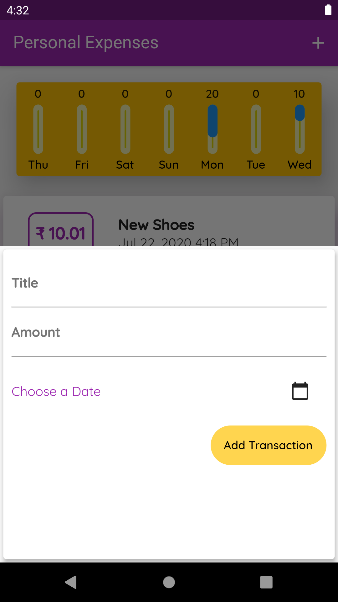

# [Expense Tracker](https://amitpatil215.github.io/Expense-Tracker/#/)
For live demo click [here](https://amitpatil215.github.io/Expense-Tracker/#/)

Smartly manage all your expenses!

## Screenshots
### Home Page


### Add Your Transaction
      

### No Transactions


## Features 
```
1. List of All Transactions
2. Add new Transactions
3. Recent week Expense Statistics
4. Delete your Transactions
```
### Widgets Implemented
```
1. Fractionally Sized Box
2. Bottom Model Sheet
3. Expanded
4. List View Builder
5. Mapping List to build Widgets
```

## Contributing
Pull requests are welcome. For major changes, please open an issue first to discuss what you would like to change.

Please make sure to update tests as appropriate.

